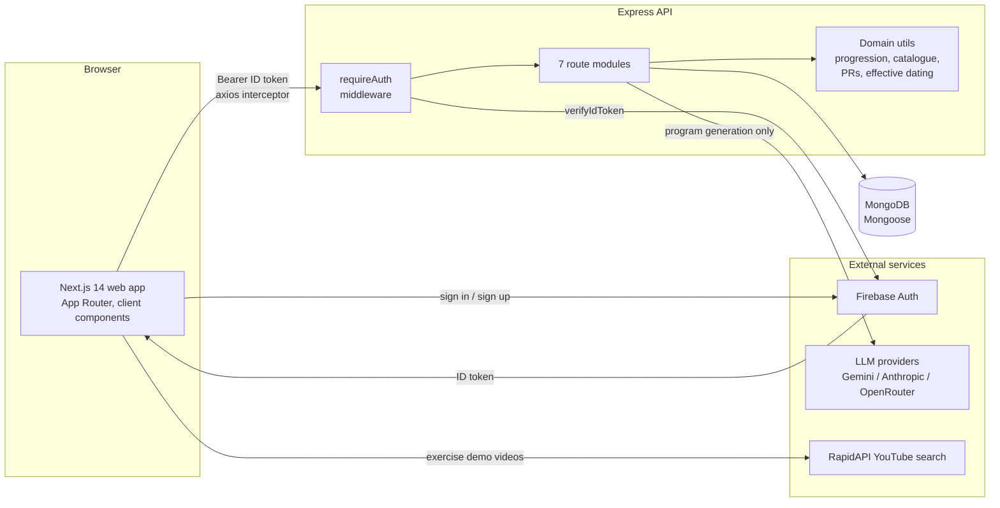
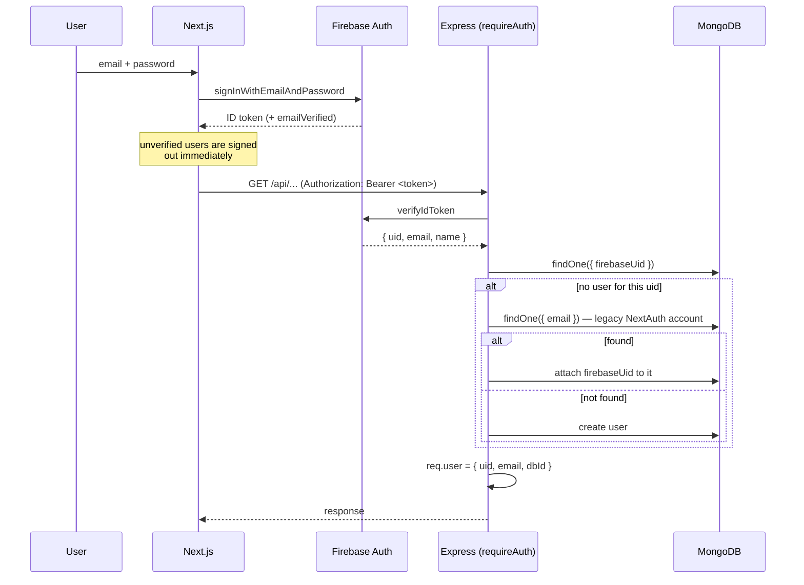
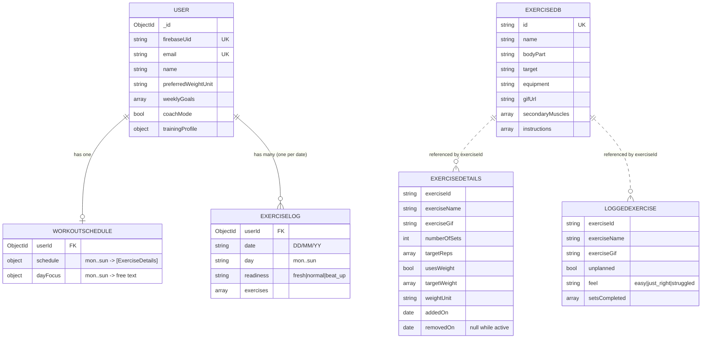
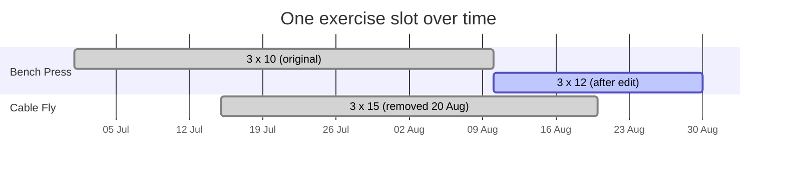
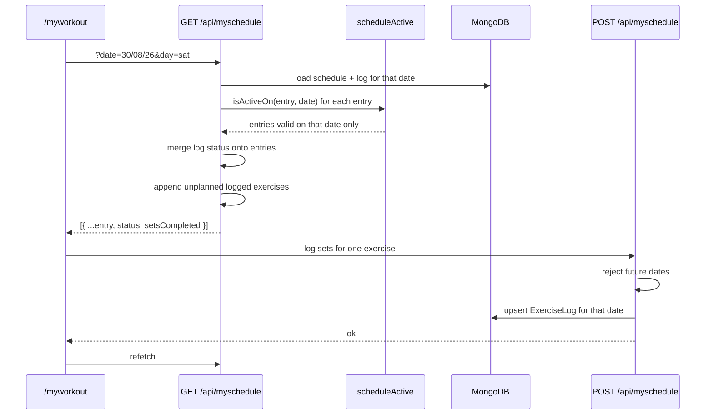
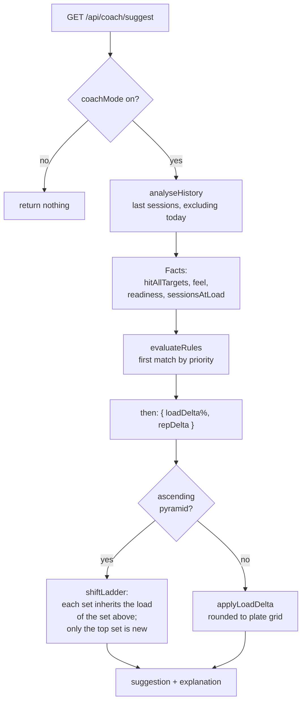
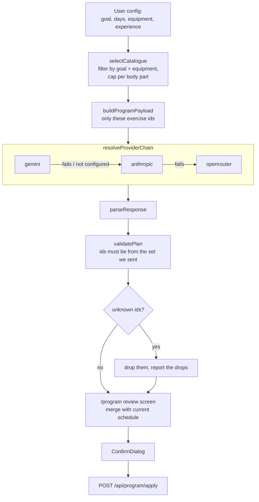
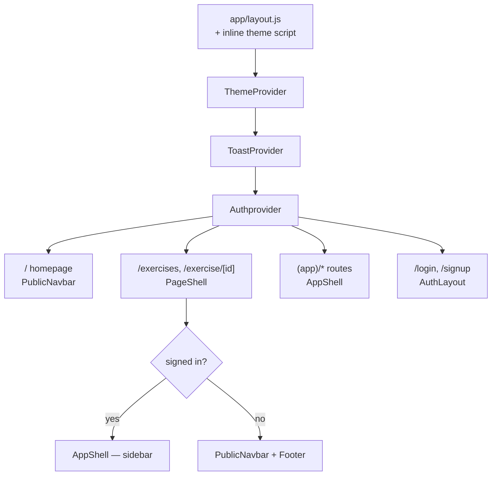
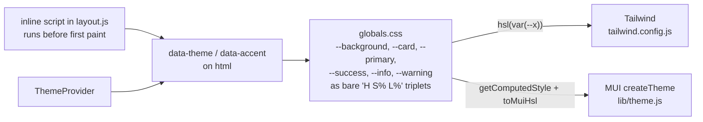

# Architecture

Fit Voyage is a workout planning and logging app. Three deployable pieces plus two
external services.

- `web/` — Next.js 14 (App Router), all rendering client-side, MUI + Tailwind
- `backend/` — Express (ESM), Mongoose, deployed separately
- MongoDB — single database, four collections
- Firebase Auth — identity; the backend never stores a password
- An LLM provider chain — used for one feature only (program generation)

A React Native app is planned and will consume the same Express API, which is the
reason the API exists as a separate service at all rather than living in Next.js
route handlers.

---

## System



`web` talks to YouTube search directly rather than through the API — it is the one
call that needs no user data and no secret worth protecting server-side. Everything
else goes through Express.

---

## Authentication

Firebase owns credentials entirely. The backend has no password field, no hashing,
no reset flow. It trusts a verified ID token and maps it to a local user document.



Two things worth knowing:

**Users are created lazily**, on first authenticated request rather than at signup.
Signup only talks to Firebase. This means the app has no "registration failed
halfway" state to reconcile.

**The legacy-email branch** exists because this project migrated from NextAuth
credentials to Firebase. Accounts created before the migration have an email but no
`firebaseUid`; the first Firebase-authenticated request with a matching email
adopts them. Once no pre-migration accounts remain, that branch can go — it is the
only place the app trusts an email as an identity key.

**Every route derives its user from `req.user.dbId`.** No endpoint accepts a user
id from the client. This was the fix for an IDOR class of bug found in an earlier
audit and it is the single most important invariant in the API.

---

## Data model

Four collections. `ExerciseDB` is a read-only catalogue; the other three are
per-user.



`trainingProfile` holds goal, experience, daysPerWeek, availableEquipment,
bodyWeight and goalWeight. It exists to feed program generation, not to be
displayed.

### Denormalisation, on purpose

`exerciseName` and `exerciseGif` are copied into both the schedule and the log
rather than joined from `ExerciseDB` at read time. Two reasons: a logged workout
should still render correctly if the catalogue entry is later renamed or removed,
and the schedule and workout screens would otherwise need a lookup per row on
every render.

---

## Effective dating

The single most important design decision in the data model, and the one that is
least visible from the UI.

**Problem.** A schedule is a living document, but a log refers back to it. If a
user swaps an exercise on Monday, last week's Monday must not retroactively show
the new exercise, and a completed workout must keep the rep targets it was actually
measured against.

**Solution.** Schedule entries are never mutated or deleted. Each carries a
validity window:

```
addedOn   <= X < removedOn        →  entry was active on date X
removedOn === null                →  still active
```

Three operations, in `backend/routes/saveWorkout.js`:

| Action | What actually happens |
| --- | --- |
| Add | insert with `addedOn = now`, `removedOn = null` |
| Edit (PATCH) | set `removedOn = now` on the old entry, insert a new one with `addedOn = now` |
| Remove (DELETE) | set `removedOn = now`. Nothing is pulled from the array |



Reads filter through `isActiveOn(exercise, date)` in
`backend/utils/scheduleActive.js`. When `addedOn` is missing — entries created
before this was introduced — it falls back to `exercise._id.getTimestamp()`,
because a MongoDB ObjectId embeds its creation time. **That is why this feature
shipped with no data migration.**

The cost is that the schedule array only grows. At personal-app scale that is
irrelevant; if it ever matters, tombstones older than the retention window can be
compacted.

---

## Request flow: logging a workout



The GET endpoint serves two shapes depending on whether `date` is supplied — with
a date it returns a flat per-day array, without one it returns the raw schedule
document. **This is a known wart**, noted in `CODE-SMELLS.md`; the browse endpoint
was later added as a separate route specifically to avoid repeating it.

---

## Progressive overload engine

Deterministic. No LLM involved — see `DECISIONS.md` for why.



Rules are **data, not code** — `{ id, priority, when, then, explain }` with a tiny
operator vocabulary (`eq`, `neq`, `in`, `gte`, `lte`). First match by priority
wins. This is what makes them extendable, and eventually user-configurable,
without touching the evaluator.

Two rounding invariants are regression-tested in
`backend/test/progression.test.js`:

- a "hold" decision returns **exactly** the same weight (a 0% delta must not be
  grid-rounded — 18.5kg was becoming 18.75kg)
- a forced increment lands **on** the grid, never off it (15.25kg was possible when
  the increment was applied to an already-off-grid weight)

**One-rep max is never used to decide progression.** `estimateOneRepMax` exists in
`utils/personalRecords.js` and is used only to display PRs.

---

## AI program generation

The one feature that calls an LLM, and it is deliberately fenced in.



Providers implement one interface — `complete({ system, payload }) → text` — using
raw `fetch` with an `AbortController` timeout. No vendor SDKs. All parsing,
validation and fallback live in shared orchestration, so adding a provider is one
small file.

Two guardrails worth naming:

- **`selectCatalogue` has a floor.** Trimming is skipped below
  `MIN_TRIM_THRESHOLD` (60) and goal filtering keeps at least
  `MIN_AFTER_GOAL_FILTER` (10). Without these, a bodyweight-only user was being
  handed 8 exercises to build a week from.
- **The model can only return ids we sent it.** `validatePlan` checks against
  exactly that set. A hallucinated exercise is dropped and reported, never
  scheduled.

---

## Frontend structure



`PageShell` is the piece that lets one page serve both audiences: the exercise
browser and detail pages render inside the sidebar when signed in and inside the
public navbar when not, instead of existing twice.

### Theming

One source of colour, two consumers.



Two details that are easy to get wrong and were both bugs at some point:

- **MUI cannot parse space-separated `hsl()`.** Its `colorManipulator` splits on
  commas, so `hsl(240 10% 12%)` decomposes to `NaN`. `toMuiHsl` converts to the
  comma form. Tailwind wants the bare triplet; MUI wants a complete function.
- **Every `readVar` needs a fallback.** `getComputedStyle` returns `""` before the
  stylesheet is applied, and passing `undefined` into `createTheme` *erases* MUI's
  default rather than falling back to it.

Semantic status colours (`--success`, `--info`, `--warning`) sit **outside** the
`[data-accent]` blocks on purpose: "new" and "already scheduled" must mean the same
thing whichever accent the user picks.

---

## Conventions

- **No user id from the client, ever.** `req.user.dbId` only.
- **Read-time computation over write-time flags.** Personal records are detected
  when read, not stamped on the log. The same input always produces the same
  answer, and the rules can change without a backfill.
- **Rest days are derived**, from having nothing scheduled — never stored. A stored
  flag could disagree with the actual plan.
- **Future dates are rejected server-side**, not just hidden in the UI.
- **Soft delete everywhere** in the schedule. See effective dating.
- **`node --test`** for tests, no test framework dependency.
- **Raw `fetch` for LLM providers**, no SDKs.
